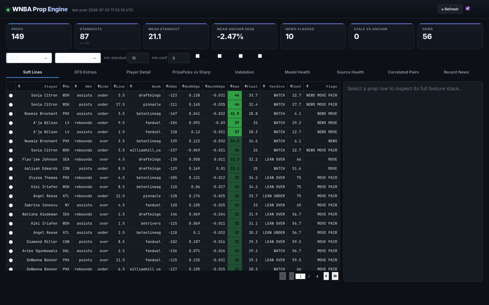
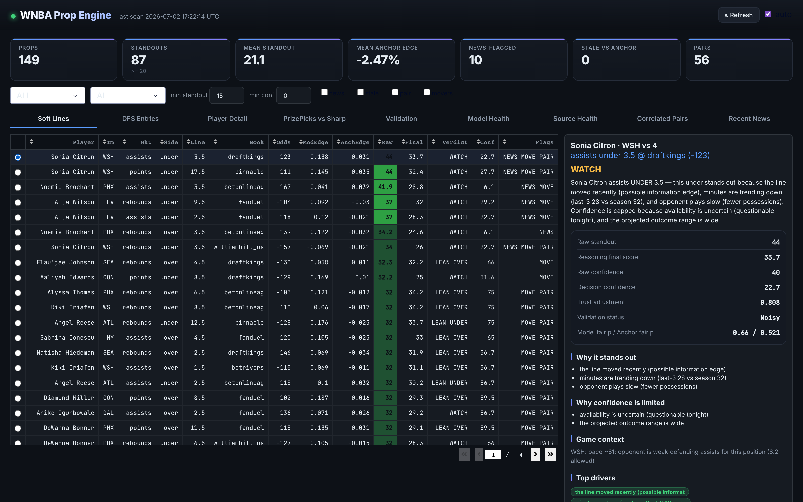
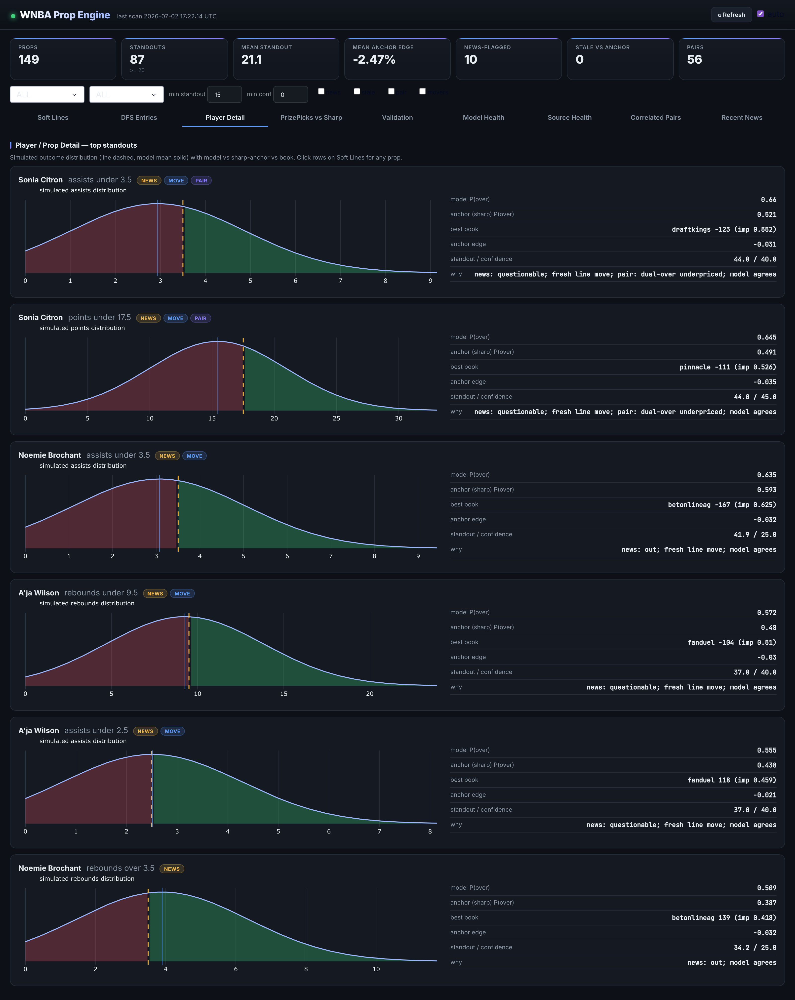
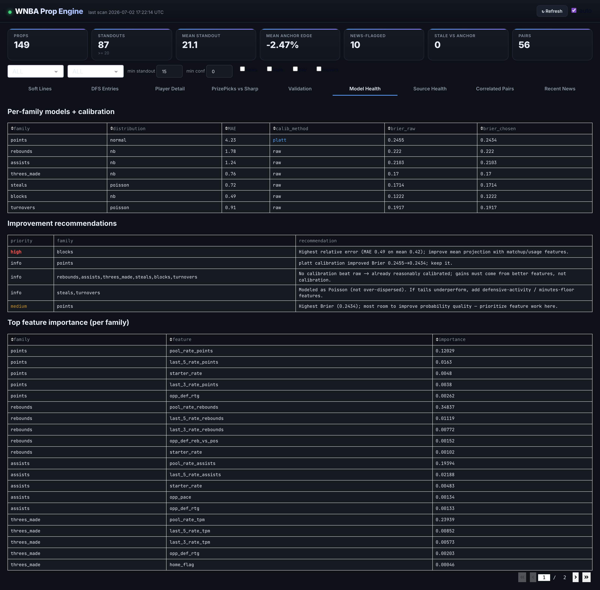
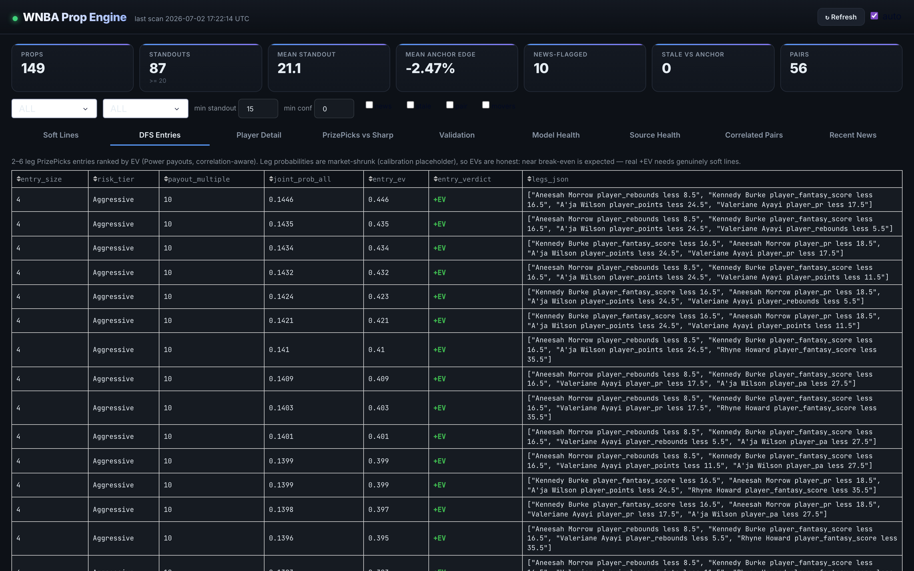
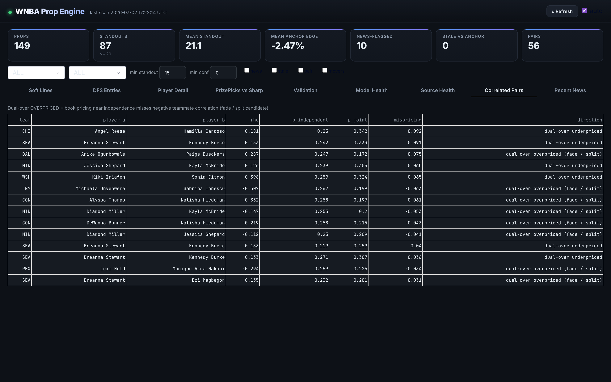

# WNBA DFS Prop Engine + Dashboard

A local, interactive decision-support tool for **WNBA player props**, oriented toward
**DFS pick'em apps** (PrizePicks, Underdog, Sleeper) rather than sportsbooks. It ingests real
multi-season data, prices props with per-family models + Monte-Carlo simulation, compares them
to the **sharp sportsbook market** (used only as a fair-value benchmark), reasons over the
evidence in plain English, and surfaces everything in a Dash dashboard.

> **This is a research / decision-support tool, not betting advice.** It does not place bets.
> DFS payout multipliers are configurable and should be verified against the app. Gamble
> responsibly; never wager more than you can afford to lose.

---

## Dashboard

The board ranks props by a **CLV-predictive standout score** (deliberately *not* raw model
edge), with heat-coloring, per-prop verdicts, and confidence shown separately from edge.



Click any prop for a **plain-English breakdown** grounded in real feature values — and a
side-by-side view of the raw model, the calibrated probability, the reasoning-layer decision,
and the validation-adjusted trust:



<details>
<summary><b>More views</b> — Player Detail, Model Health, DFS Entries, Correlated Pairs</summary>

**Player Detail** — simulated outcome distribution per prop, with model vs sharp anchor:


**Model Health** — honest per-family accuracy, calibration, and improvement recommendations:


**DFS Entries** — correlation-aware 2–6 leg PrizePicks entries with correct payout EV:


**Correlated Pairs** — different-team, same-game pairs (game-environment correlation):


</details>

---

## The honest state (read this first)

This project has been built with a strict "verify before you trust" discipline, and the
results are reported honestly:

- **Single-prop box-score modeling is ~at market efficiency.** Large raw model "edges" are
  mostly noise — a real CLV backtest against historical closing lines came out **~break-even**
  (+0.4%, 52% beat close, small sample).
- **Standard PrizePicks lines are tightly aligned with sportsbooks** (max gap ~1 point in a
  static scan). The soft-line edge shows up mainly in **news-latency windows**.
- The two most plausible real edges are **news-latency stale lines** and **correlation
  mispricing** — both are surfaced but neither is proven profitable yet.
- The dashboard therefore **separates edge from confidence**, ranks by a CLV-predictive
  standout score (not raw model edge), and shows *why* it likes or dislikes each line.

Treat flagged props as **research signals to review**, not guaranteed value.

---

## Quick start

```bash
# 1. one-time: create venv + install (Python 3.11+ recommended; tested on 3.14)
python3 -m venv .venv
./.venv/bin/pip install -r requirements.txt

# 2. add your API keys to .env  (see "Keys" below)

# 3. start everything — scans, serves the dashboard, opens your browser
./.venv/bin/python start.py
```

Or **double-click `Start WNBA Dashboard.command`** in Finder.

`start.py` runs an initial scan (~10–15s the first time), keeps re-scanning every 2 minutes in
the background, serves the dashboard, and opens **http://127.0.0.1:8050** automatically. Keep
the terminal window open; `Ctrl-C` stops it. Hard-refresh the browser (`Cmd+Shift+R`) the first
time so the CSS loads fresh.

### Keys (`.env` at the project root)
```
ODDS_API_KEY=...          # The Odds API (live + historical props, incl Pinnacle)
BALLDONTLIE_API_KEY=...    # BallDontLie WNBA (2008–2026 box scores + positions)
X_BEARER_TOKEN=...         # X/Twitter API (news monitoring) — paste RAW, do not URL-decode
```

---

## Data sources (all real)

| Source | Use | Access |
|---|---|---|
| **BallDontLie WNBA** | 2008–2026 box scores + positions (primary history) | API key |
| **ESPN** | box scores, **confirmed starters**, injuries, live schedule | public API |
| **The Odds API** | multi-book sportsbook props + **Pinnacle** anchor; **historical** closing lines | API key |
| **PrizePicks** | DFS pick'em lines (your execution venue) | public JSON via `curl_cffi` |
| **X / Twitter** | beat-writer / injury news for latency signals | API key |
| **data.wnba.com** | keyless real box-score fallback | public JSON |

Dead ends (don't retry): `stats.wnba.com` (Akamai-blocked), SportsData.io trial (fake stats),
httpx/requests on PrizePicks (Cloudflare — use `curl_cffi` impersonate="chrome").

---

## Architecture

Three decoupled layers: a **scanner** computes everything and writes SQLite; the **dashboard**
only reads. The scanner never blocks the UI.

```
src/                 ESPN ingest + SQLite schema (games, player_game_stats, ...)
balldontlie_*.py     BallDontLie client + ETL (multi-season backfill)
propmodel/           per-family models, minutes×rate, NB/Poisson distributions,
                     hierarchical pooling, calibration, Monte-Carlo simulation
anchor_lines.py      sharp Pinnacle/consensus fair value (the benchmark)
pair_engine.py       correlated pairs (DIFFERENT-team, same-game copula)
dfs_ev.py            PrizePicks Power/Flex payout + multi-leg entry EV
feeds/               live feeds: X, ESPN, Odds snapshots, PrizePicks, prop taxonomy,
                     diff engine (line moves), scheduler, storage
reasoning/           evidence buckets -> decision engine -> plain-English explanations
scanner/             run_live_scan (orchestrator), compute_scan_features, prizepicks_scan
model_health.py      per-family MAE/Brier/calibration + improvement recommendations
dashboard/           Dash UI (layout, callbacks, components, data_access)
dashboard_app.py     the app;  start.py -> one-command launcher
```

### Databases
- `data/wnba.sqlite` — historical stats (games, player_game_stats, team_game_stats, positions).
- `data/feeds.sqlite` — live layer (current_prop_scan, prizepicks_scan, current_entries,
  current_pair_scan, odds_snapshots, news_events, prop_family_metrics, source_health, …).

---

## The dashboard (9 tabs)

- **Soft Lines** — ranked standout props; click a row for the full detail panel.
- **DFS Entries** — 2–6 leg PrizePicks entries with correct Power/Flex EV (correlation-aware).
- **Player Detail** — top standouts with a simulated outcome distribution + model/anchor/book.
- **PrizePicks vs Sharp** — every PP line (incl combos, demon/goblin) vs the sharp benchmark.
- **Validation** — per-family calibration status (Validated / Promising / Noisy / Model-only).
- **Model Health** — per-family MAE/Brier, feature importance, improvement recommendations.
- **Source Health** — which feeds are live/viable and their latency.
- **Correlated Pairs** — **different-team**, same-game pairs (game-environment correlation).
- **Recent News** — parsed X/injury events.

The detail panel shows **raw model vs calibrated probability vs reasoning decision vs
validation-adjusted trust** side by side, plus grounded English ("minutes trending up 29 vs 26,
in the starting five, opponent weak defending rebounds for this position").

---

## Coverage & modeling notes

- **Prop families:** points/rebounds/assists (modeled), plus combos PRA/PR/PA/RA (**simulated**
  from component models with real covariance), threes/steals/blocks/turnovers (per-family), and
  fantasy score. Discovered dynamically from the live PrizePicks feed — no hallucinated coverage.
- **Distributions:** Negative Binomial for over-dispersed counts, Poisson where not, Normal +
  law-of-total-variance for points. Calibrated per family (Platt/isotonic where it helps).
- **DFS EV:** PrizePicks Power/Flex multipliers (in `dfs_ev.py`, **verify against the app**);
  breakeven is ~55–58% per leg. Entry probabilities are market-shrunk so EVs are honest.
- **Pairs:** two players must be on **different teams**; real cross-team correlation only exists
  for same-game opponents (shared pace/total, ρ≈0.12), so those edges are small by nature.

---

## Refreshing the models / periodic tasks

```bash
./.venv/bin/python model_health.py                 # retrain + eval per-family; refresh Model Health
./.venv/bin/python -m feeds.health_snapshot        # refresh Source Health
./.venv/bin/python -m balldontlie_etl              # backfill more seasons (edit seasons inside)
```

### ⚠️ Cache gotcha (important)
The scanner **disk-caches models + projections** in `data/scan_bundle.joblib` for 30 min.
**Any change to features/models/projection requires deleting it** to take effect:
```bash
rm data/scan_bundle.joblib
```
The per-family models are cached in `models/family_calibration.joblib` (rebuilt by
`model_health.py`).

---

## Analysis / backtest scripts (standalone)

```bash
./.venv/bin/python run_stage4_clv.py               # CLV backtest vs historical closing lines
./.venv/bin/python run_stage6_anchor_vs_softbooks.py   # stale-line frequency vs the sharp anchor
./.venv/bin/python run_stage6_sgp_validation.py    # copula vs independence for pairs
./.venv/bin/python run_stage6_scraper_health.py    # feed viability report
```

## Requirements
pandas, numpy, scipy, scikit-learn, statsmodels, sqlalchemy, requests, httpx, curl_cffi,
beautifulsoup4, lxml, rapidfuzz, joblib, python-dotenv, dash, plotly, apscheduler.
(`pip install -r requirements.txt`)

## Development log
The stage-by-stage research notes, honest status reports, and open questions from the build
live in **[`docs/`](docs/)** — including the negative results and verified-and-rejected data
sources. They document the process, not just the outcome.
